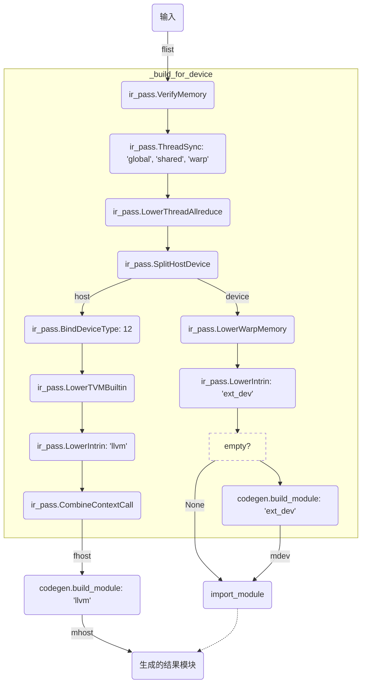
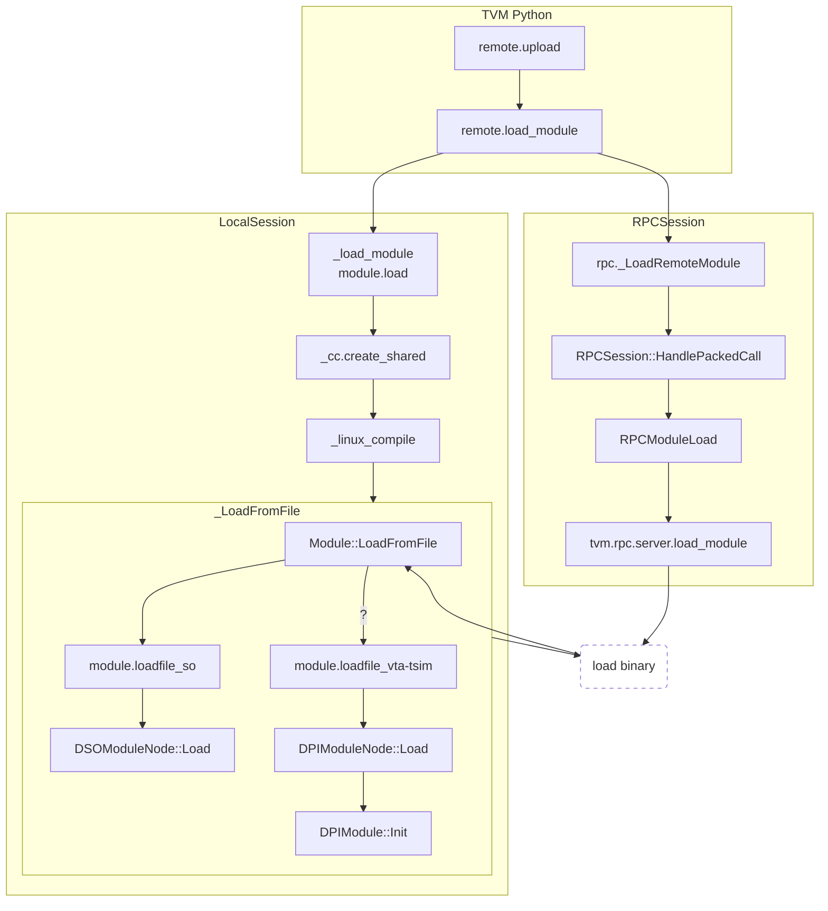

最近看了很多TVM/VTA后端代码生成的代码，现在就把近日所得总结一下，以备有需求的朋友参考。

<!--more-->

## 关于TVM/VTA

[TVM](https://tvm.ai)是一个深度学习描述框架，通过Python代码描述算子（输入、输出、运算方法等）形成抽象语法树（Abstract Syntax Tree，AST），然后在TVM内部转换为中间表示（Intermediate Representation，IR），最终转换成目标平台的机器代码，以作为算子用于构成更复杂的神经网络。

[VTA](https://tvm.ai/vta)（Versatile Tensor Accelerator，多功能张量加速器）是TVM框架的一个扩展，可以简单理解成一个深度神经网络的底层硬件实现。

这篇文章就是TVM从IR生成后端机器代码过程的一个概览。

由于手头并没有VTA的硬件，因此使用了TVM提供的模拟器`tsim`；以下所述的过程都是针对`tsim`的，如果针对其他硬件后端，大体思想应当是一致的，但细节肯定颇有不同。
{:.info}

## 分析的代码样例

分析代码生成流程时，使用了官方教程提供的测试代码，详见[Get Started with VTA](https://docs.tvm.ai/vta/tutorials/vta_get_started.html)。

以下描述的流程从`vta.build`的调用开始。

## 代码生成

`vta.build`首先判断出我们host端（宿主平台，主程序所运行的平台）使用`llvm`做代码生成（`target_host='llvm'`）；随后，它直接将调用转发给`tvm.build`。

### 整理输入

由于Python的特殊性，函数参数的类型是不定的；TVM允许传入`tvm.build`函数的参数有如下四种：

- `Schedule`
- `LoweredFunc`
- `[LoweredFunc]`
- `{target: [LoweredFunc]}`

转换经历下图的过程：

$$
\fbox{Schedule}
\xrightarrow{lower} \fbox{LoweredFunc}
\xrightarrow{[*]} \fbox{[LoweredFunc]}
\xrightarrow{\{target: *\}} \fbox{\{target : [LoweredFunc]\}}
$$

最终所有的输入都被整理成如下形式：

```python
target_flist = {'ext_dev': [LoweredFunc]}
```

### 降级代码表示

这一部分对应于函数`lower`，总的流程参看下图：

```mermaid
graph TD
Input(输入)-->|sch|normalize
subgraph lower
subgraph form_body
    normalize(normalize)-->|sch|ops(schedule.ScheduleOps)
    normalize-->|sch|infer(schedule.InferBounds)
    infer-->|bounds|ops
    ops-->inject(ir_pass.InjectPrefetch)
end
subgraph phase 0
    inject-->custom0(custom)
    style custom0 fill:none,stroke-dasharray:5,5
end
subgraph phase 1
    custom0-->flatten(ir_pass.StorageFlatten)
    flatten-->simpl(ir_pass.CanonicalSimplify)
    simpl-->custom1(custom)
    style custom1 fill:none,stroke-dasharray:5,5
end
subgraph phase 2
    custom1-->loop_part(<i>NOT simple_mode?</i>:<br>ir_pass.LoopPartition)
    loop_part-->|dis_vec?|no_vec(ir_pass.SkipVectorize)
    loop_part-->|otherwise|with_vec(is_pass.VectorizeLoop)
    no_vec-->inj(ir_pass.InjectVirtualThread)
    with_vec-->inj
    inj-->inj2(ir_pass.InjectDoubleBuffer)
    inj2-->rewrite(ir_pass.StorageRewrite)
    rewrite-->unroll(ir_pass.UnrollLoop)
    unroll-->custom2(custom)
    style custom2 fill:none,stroke-dasharray:5,5
end
subgraph phase 3
    custom2-->simpl2(ir_pass.Simplify)
    simpl2-->lower(ir_pass.LowerStorageAccessInfo)
    lower-->rmv(ir_pass.RemoveNoOps)
    rmv-->sel(<i>NOT disable_select_rewriting?</i>:<br>ir_pass.RewriteUnsafeSelect)
    sel-->custom3(custom)
    style custom3 fill:none,stroke-dasharray:5,5
    custom3-->bound(<i>instrument_bounds_checkers?</i>:<br>ir_pass.InstrumentBoundsCheckers)
    bound-->|otherwise|make(ir_pass.MakeAPI)
end
end
bound-->|simple_mode?|res
make-->res
res(预处理结果)
```

以我们的测试代码为例，每一趟后代码发生的变化如下表：

| 阶段 | 处理阶段                 |      是否变化      | 发生的变化                                                 |
| ---- | :----------------------- | :----------------: | :--------------------------------------------------------- |
| 0    |                          |                    | 初始状态                                                   |
| 1.1  | `StorageFlatten`         | :heavy_check_mark: | `realize` -> `allocate`，指标的表示形式（多维转化为一维）  |
| 1.2  | `CanonicalSimplify`      | :heavy_check_mark: | 双层`for`循环 -> `TAStoreBuffer2D`                         |
| 1.3  | （外部过程）             |                    |                                                            |
| 1.4  | （外部过程）             | :white_check_mark: | 增加了一些新属性                                           |
| 1.5  | （外部过程）             | :white_check_mark: | 移除了一些属性                                             |
| 1.6  | （外部过程）             | :heavy_check_mark: | 缓冲区内存分配从`produce`块中移出                          |
| 1.7  | （外部过程）             |                    | 增加同步属性                                               |
| 1.8  | （外部过程）             | :heavy_check_mark: | `A`、`B`、`C`的分配合并成`A`的分配                         |
| 1.9  | （外部过程）             |                    |                                                            |
| 2.1  | `LoopPartition`          |                    |                                                            |
| 2.2  | `VectorizeLoop`          |                    |                                                            |
| 2.3  | `InjectVirtualThread`    |                    |                                                            |
| 2.4  | `InjectDoubleBuffer`     |                    |                                                            |
| 2.5  | `StorageRewrite`         |                    |                                                            |
| 2.6  | `UnrollLoop`             | :heavy_check_mark: | 循环转化为`VTAUopLoopBegin`、`VTAUopPush`和`VTAUopLoopEnd` |
| 2.7  | （外部过程）             |                    |                                                            |
| 3.1  | `Simplify`               | :heavy_check_mark: | 缓冲区内存分配完全移除                                     |
| 3.2  | `LowerStorageAccessInfo` |                    |                                                            |
| 3.3  | `RemoveNoOp`             |                    |                                                            |
| 3.4  | `RewriteUnsafeSelect`    |                    |                                                            |
| 3.5  | （外部过程）             |                    |                                                            |
| 3.6  | （外部过程）             |                    |                                                            |
| 4    |                          |                    | 最终状态                                                   |

标明“（外部过程）”是从C++注册的处理过程，在Python的跟踪过程中无法看到。
{:.info}

这部分的中间结果文件可以在[这里](/data/2019-10-24-tvm/mid-results.zip)下载。

### 遍历`target_list`检查

对所有的目标$$\langle target, flist\rangle \in target\_flist$$：

- 函数名查重：存在相同的函数名字就报错
- 验证目标$$target$$是`str`或者`_target.Target`

下面，flist被传入函数`_build_for_device`处理。

### 为特定设备生成目标代码

总的思想是这样的：将`flist`分离为宿主代码（`fhost`）和设备代码（`mdev`），然后分别生成机器代码；其中设备端的模块会导入到宿主模块中，最终的结果是宿主代码模块`mhost`。

$$
\fbox{flist} \xrightarrow{\text{_build_for_device}}
\left\{\begin{array}{l}
    \fbox{fhost} \xrightarrow{\text{codegen.build_module}} \\
    \fbox{mdev} \xrightarrow{\text{import_module}}
\end{array}\right\}
\to
\fbox{mhost}
$$

下图是IR的多趟（pass）处理流程：



## 加载生成好的目标代码

这部分对应的Python代码如下：

```python
remote.upload("vadd.o")
f = remote.load_module("vadd.o")
```

### 流程概览



下面代码分`tsim`和真实硬件两种情况。

相关分析只列出被执行的关键路径，依照代码中的注释应当很容易理解。代码块的缩进表示嵌套的函数调用。
{:.info}

贴出的代码有Python也有C++，由于每一段都有注释，应该很好分辨（Python是`#`，C++是`//`）。
{:.warning}

### 使用模拟器

此时代码中的远端设备`remote`是一个`LocalSession`。

这一部分的关键就是拼接命令，调用系统编译器`g++`来把对象文件（`.o`文件）链接成动态库。

```python
# ..., then, in LocalSession.load_module
#   with path = "vadd.o"
_load_module(self._temp.relpath(path))
# _load_module is module.load
```

```python
# in module.load, with path = (full path for "vadd.o"), fmt = ""
if path.endswith(".o"): # true
    _cc.create_shared(path + ".so", path)
```

- ```python
  # in create_shared
  #   with output  = "vadd.o.so"
  #        objects = "vadd.o"
  #        options = None
  #        cc      = "g++"
  if sys.platform == "darwin" or sys.platform.startswith("linux"):
      _linux_compile(output, objects, options, cc)
  ```

  - ```python
    # in _linux_compile
    #   with output      = "vadd.o.so"
    #        objects     = "vadd.o"
    #        options     = None
    #        compile_cmd = "g++"
    cmd = [compile_cmd] # cmd: g++
    if output.endswith(".so"): # true
        cmd += ["-shared", "-fPIC"]
        if sys.platform == "darwin": # true
            cmd += ["-undefined", "dynamic_lookup"]
    else: # false, ...
    # cmd: g++ -shared -fPIC -undefined dynamic_lookup
    cmd += ["-o", output]
    # cmd: g++ -shared -fPIC -undefined dynamic_lookup -o vadd.o.so
    if isinstance(objects, str): # true
        cmd += [objects]
    else: # false, ...
    # cmd: g++ -shared -fPIC -undefined dynamic_lookup -o vadd.o.so vadd.o
    if options: # false, ...
    # run cmd
    proc = subprocess.Popen(cmd, stdout=subprocess.PIPE, stderr=subprocess.STDOUT)
    (out, _) = proc.communicate()
    if proc.returncode != 0:
        msg = "Compilation error:\n"
        msg += py_str(out)
        raise RuntimeError(msg)
    ```

  ```python
  # back in create_shared
  else: # false, ...
  ```

```python
# back in module.load
    path += ".so"
else: # false
       # ...
return _LoadFromFile(path, fmt)
```

`_LoadFromFile`是Python端封装的C++函数，在C++端对应`Module::LoadFromFile`，见[最终加载动态库](#最终加载动态库)。
{:.info}

### 使用真实的VTA设备

这里，由于没有真实设备，执行流程是~~静态分析~~瞪眼猜测的结果。

此时远端设备`remote`是一个`RPCSession`。

在`LoadRemoteModule`函数执行前也应该有一些额外的操作，把`.o`对象文件生成为动态链接库。
{:.warning}

```c++
// in "rpc._LoadRemoteModule"
sess->CallRemote(RPCCode::kModuleLoad, args[1]);
```

```c++
// in RPCSession::HandlePackedCall
switch (code_)
{
    // ...
    case RPCCode::kModuleLoad: CallHandler(RPCModuleLoad); break;
    // ...
}
```

```c++
// in RPCModuleLoad
fsys_load_ = runtime::Registry::Get("tvm.rpc.server.load_module");
/* ... */ (*fsys_load_)(file_name);
```

```c++
// in "tvm.rpc.server.load_module"
// Below is Objective-C++:
//   - not quite familiar
//   - might misinterpret
// in "tvm.rpc.server.load_module", with name = "vadd.o.so"s
std::string fmt = GetFileFormat(name, "");
```

- ```c++
  // in tvm::runtime::GetFileFormat
  //   with file_name = "vadd.o.so"s
  //        format    = ""s
  if (format.length() == 0) { // true
      // ...
      size_t pos = file_name.find_last_of("."); // 6
      if (pos != std::string::npos) { // true
            return file_name.substr(pos + 1, file_name.length() - pos - 1);
            // "vadd.o.so"s.substr[from: 6, length: 2] = "so"s
      }
      // ...
  } // ...
  ```

```c++
// fmt = "so"s
// ... converting `name` to `path`
//     not quite sure because of use of Obj-C++
NSString* path = [base stringByAppendingPathComponent:
                         [NSString stringWithUTF8String:name.c_str()]];
// ... and again back to `name`
name = [path UTF8String];
// finally! loading from file?
// - no! yet another propagation
/* ... */ Module::LoadFromFile(name, fmt);
```

### 最终加载动态库

这一部分核心就是转化为系统调用`dlopen`（POSIX系统）或`LoadLibraryW`（Windows系统）。

```c++
// in Module::LoadFromFile
//   with file_name = ... ("vadd.o.so" with full path)
//        format    = "so"s
std::string fmt = GetFileFormat(file_name, format);
// "so"s.length() != 0, should just return "so"s
// fmt = "so"s
if (fmt == "dll" || fmt == "dylib" || fmt == "dso") { /* ... */ } // false
std::string load_f_name = "module.loadfile_" + fmt;
// load_f_name = "module.loadfile_so"s
f = Registry::Get(load_f_name);
/* ... */ (*f)(file_name, format);
```

```c++
// in "module.loadfile_so"
n = std::make_shared<DSOModuleNode>();
n->Init(args[0]);
```

```c++
// in DSOModuleNode::Init
DSOModuleNode::Load(name); // propagate to LoadLibraryW/dlopen
// ...
InitContextFunctions([this](const char* fname) { return GetSymbol(fname); });
// Load the imported modules
const char* dev_mblob = GetSymbol(runtime::symbol::tvm_dev_mblob);
if (dev_mblob != nullptr) { /* ... */ }
```
